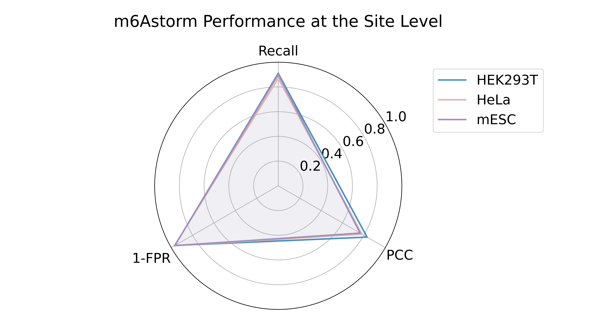

**m6Astorm: Stoichiometry-preserving and stochasticity-aware identification of m6A from direct RNA sequencing**

A deep learning framework that enables stoichiometry-preserving and stochasticity-aware identification of m6A modifications at single-molecule and single-nucleotide resolution. m6Astorm is trained on matched direct RNA sequencing (dRNA-seq) and GLORI data from HEK293T cells, using a dual-objective strategy that jointly optimizes the binary cross entropy loss for classifying methylated status at single-molecule level, regularized by a confidence-aware penalty term suppressing low-certainty predictions, and the stoichiometry bias for accurate quantitative at the single-nucleotide level.

- [Preprocess](#preprocess)
- [Install m6Astorm](#install-m6astorm)
- [Feature extraction](#feature-extraction)
- [Predict m6A modification](#predict-m6a-modification)
- [Test Data](#test-data)
- [Training and evaluating the m6Astorm](#training-and-evaluating-the-m6astorm)

# Preprocess

Before runing m6Astorm:

1. Basecalling

   Convert raw `fast5` signal data into nucleotide sequences (FASTQ) using **Guppy**.

   - **Input**: `fast5/`

   - **Output**: `result/1-basecalled/`

   ```bash
   guppy_basecaller --flowcell FLO-MIN106 \
                    --kit SQK-RNA001 \
                    --num_callers 40 \
                    -i fast5 \
                    -s result/1-basecalled \
                    -r --fast5_out
   ```

2. FASTQ processing

   Process and clean up FASTQ files before alignment.

   - **Input**: `result/1-basecalled/pass/*.fastq`
   - **Output**: `result/2-fastq/U2T.fastq`

   Steps:

   1. Concatenate all FASTQ files
   2. Quality filtering and trimming (5 bp headcrop, 3 bp tailcrop)
   3. Convert uracil (U) to thymine (T) for compatibility with aligners

   ```bash
   cat result/1-basecalled/pass/*.fastq > result/2-fastq/output.fastq
   NanoFilt -q 0 --headcrop 5 --tailcrop 3 --readtype 1D < result/2-fastq/output.fastq > result/2-fastq/h5t3.fastq
   awk '{ if (NR % 4 == 2) { gsub(/U/, "T", $1); print $1 } else print }' result/2-fastq/h5t3.fastq > result/2-fastq/U2T.fastq
   ```

3. Alignment

   Align the processed reads to a reference transcriptome using **minimap2** and clean up with **samtools**.

   - **Input**: `result/2-fastq/U2T.fastq`, `ref.fa`
   - **Output**: `result/3-aligned/filtered.sorted.bam`

   Steps:

   1. Spliced alignment with no secondary alignments
   2. Filter for primary alignments only (flag 0 or 16)
   3. Sort and index BAM file

   ```bash
   minimap2 -G200k --secondary=no -ax splice -uf -k14 -t 40 ref.fa result/2-fastq/U2T.fastq > result/3-aligned/raw.sam
   awk '{if(($2=="0")||($2=="16")) print $0}' result/3-aligned/raw.sam > result/3-aligned/filtered.sam
   samtools view -bS result/3-aligned/filtered.sam | samtools sort -@ 40 -o result/3-aligned/filtered.sorted.bam
   samtools index result/3-aligned/filtered.sorted.bam
   ```

4. Nanopolish eventalign

   Generate signal-level alignment using **Nanopolish**.

   - **Input**: `fast5/`, `U2T.fastq`, `filtered.sorted.bam`, `ref.fa`
   - **Output**: `result/4-eventalign/eventalign.txt`

   Steps:

   1. Index the FASTQ with corresponding FAST5 files
   2. Run `eventalign` to align raw signal to the reference sequence

   ```bash
   nanopolish index -d fast5 result/2-fastq/U2T.fastq
   nanopolish eventalign --reads result/2-fastq/U2T.fastq \
                         --bam result/3-aligned/filtered.sorted.bam \
                         --genome ref.fa \
                         --samples --signal-index --scale-events \
                         -t 40 > result/4-eventalign/eventalign.txt
   ```

✅**The final output of the preprocessing step**: `result/4-eventalign/eventalign.txt`

# Install m6Astorm

We recommend using **Conda** for environment management

```python 
conda create -n m6astorm python=3.12.9
conda activate m6astorm
conda install pandas=2.2.3 numpy=1.26.4 scikit-learn=1.6.1 scipy=1.15.3
pip install EMD-signal==1.6.4
pip install torch==2.7.1 torchvision==0.22.1 torchaudio==2.7.1

```

Clone the repository:

```bash
git clone https://github.com/wfy1373/m6Astorm.git
cd m6Astorm
```

# Feature extraction

Extract signal-based features from Nanopolish `eventalign.txt` output.

```bash
python feature_extract.py  --eventalign /path/to/eventalign.txt \
                    --out_dir /path/to/output 
```

- `--eventalign`: Path to the Nanopolish `eventalign.txt` file
- `--out_dir`: Directory to save the extracted feature file (`data_feature.txt`)

# Predict m6A modification

Use the pre-trained model to predict m6A modification from the extracted signal features.

```bash
python predict.py --data_pre /path/to/data_feature.txt \
                  --model_dir model \
                  --out_dir result \
                  --min_coverage 20 \
                  --mod_prob_thresh 0.5
```

Parameters:

- `--data_pre`: Path to the extracted feature file (`data_feature.txt`)
- `--model_dir`: Directory containing the pre-trained model
- `--out_dir`: Directory to save prediction results
- `--min_coverage`: Minimum read coverage required for a site to be considered (default: `20`)
- `--mod_prob_thresh`: Probability threshold for calling a read as modified (default: `0.5`)

Outputs:

- `read_level_result.txt`: Modification prediction for each **individual read** (single-molecule resolution)
- `site_level_result.txt`: Aggregated **site-level** modification ratio and coverage


# Test Data

Example input data is provided in the `test/` directory. 

You can use this dataset to test the pipeline functionality.

**Runtime Notes**

Processing the provided example file `test/nanopolish_output_test.txt` takes approximately **15 minutes on CPU** during the feature extraction step.

For larger datasets, it is recommended to split the input file and submit multiple jobs in parallel to accelerate the process.

# Training and evaluating the m6Astorm

m6Astorm was trained on the HEK293T cell line, where 80% of sites with coverage ≥20 were used for training and the remaining 20% for testing.
The HeLa and mESC datasets were used as independent test sets without any training on them.

- Read level: evaluated using AUROC and AUPR from per-read classification.

- Site level: evaluated using Pearson correlation coefficient (PCC) between predicted and GLORI stoichiometries, Recall on GLORI-positive sites, and False Positive Rate (FPR) on GLORI-negative sites.


